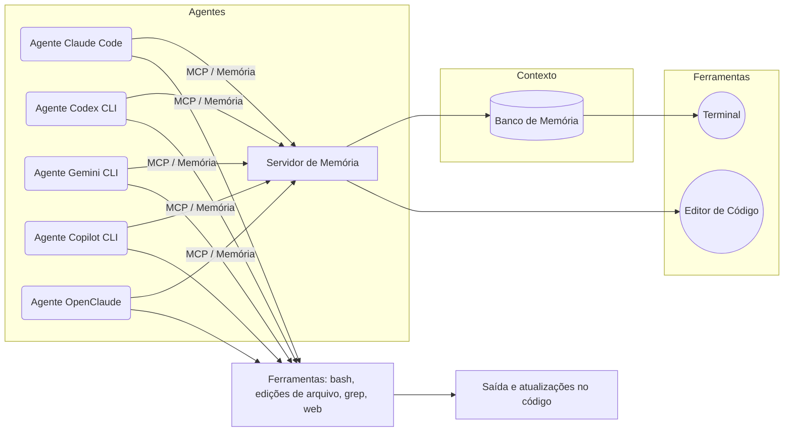

# AI Agents Starter Kit

Bem-vindo ao *AI Agents Starter Kit*. Este repositório fornece tudo o que você precisa para começar a usar **agentes de código** com diferentes modelos de LLM (Claude Code, Codex, Gemini, Copilot, OpenClaude).

---

## Visão Geral

- **O que é**: Um kit completo de agentes de desenvolvimento alimentados por IA, projetado para acelerar tarefas de codificação como depuração, geração de código e revisão.
- **Modelos suportados**: Claude Code (Anthropic), OpenAI Codex, Google Gemini, GitHub Copilot CLI e OpenClaude (multi-modelos).
- **Funcionalidades**: operações de arquivo (read/write/edit), execução de comandos shell, chamadas de API, pesquisa web, e fluxos multi-agente (sub-agents) para tarefas complexas.
- **Plataformas**: CLI (Terminal) e VS Code (com extensões). Totalmente cross-platform (Linux, macOS, Windows).

---

## Requisitos

- **Sistema**: macOS (10.15+), Ubuntu 20.04+ ou Windows 10/11.
- **Softwares**: Node.js >=20 (para CLIs e exemplos Node/TS) e Python >=3.10 (para exemplos Python).
- **CLIs**: Claude Code (via script/brew), Codex CLI (npm), Gemini CLI (npm), Copilot CLI (npm), OpenClaude (npm).
- **Chaves/API**: Conta ou chave API nos serviços (OpenAI, Anthropic, Google, GitHub). Opcionalmente rodar local (ex: modelo via OpenClaude + Ollama).
- **Ambiente**: Terminal com git instalado, internet.

---

## Quickstart (5 minutos)

### 1. Clone o repositório

```bash
git clone https://github.com/lemondev/ai-agents-starter-kit.git
cd ai-agents-starter-kit
```

### 2. Instale os CLIs de agente

**Claude Code:**
```bash
curl -fsSL https://claude.ai/install.sh | bash
# ou via Homebrew:
brew install --cask claude-code
```

**OpenAI Codex CLI:**
```bash
npm install -g @openai/codex
# Na primeira vez, execute `codex` e faça login com sua conta OpenAI.
```

**Gemini CLI:**
```bash
npm install -g @google/gemini-cli
# ou: brew install gemini-cli
# Use `gemini` para rodar.
```

**GitHub Copilot CLI:**
```bash
npm install -g @github/copilot
# Use `copilot` para rodar, autentique via `/login`.
```

**OpenClaude CLI:**
```bash
npm install -g @gitlawb/openclaude
# Use `openclaude` e faça `/provider` para configurar (pronto para multi-modelos).
```

### 3. Configure variáveis de ambiente

```bash
cp .env.example .env
```

Edite `.env` com suas chaves:
```
CLAUDE_API_KEY=<sua-chave-Anthropic>
OPENAI_API_KEY=<sua-chave-OpenAI>
GITHUB_TOKEN=<token-GitHub>
GEMINI_API_KEY=<sua-chave-Gemini>
```

> ⚠️ **Nunca comite o arquivo `.env` no repositório!**

### 4. Execute exemplos básicos

```bash
# Agente Depurador (Claude Code)
cd examples/depurador-claude
claude

# Agente Gerador de Código (Codex)
cd examples/gerador-codex
codex
```

---

## Scaffold de Novo Projeto (init-ai)

Você pode adicionar rapidamente a infraestrutura de agentes de IA a qualquer projeto existente usando o gerador de scaffold `init-ai`.

```bash
# Na raiz do seu projeto:
node scripts/init-ai.mjs
```

Isso irá:
- ✅ Criar `CLAUDE.md` e `AGENTS.md` com as melhores práticas.
- ✅ Configurar as pastas `.claude/`, `.gemini/`, `.codex/` e `.agent/` com skills e agentes pré-definidos.
- ✅ Adicionar um symlink `GEMINI.md` para melhor contexto multi-CLI.
- ✅ Permitir a instalação de skills da comunidade via [skills.sh](https://skills.sh).

### Adicionar Skills da Comunidade
Para adicionar skills específicas do catálogo da comunidade:
```bash
node scripts/init-ai.mjs --add-skill
```

---

## Arquitetura do Kit



**Descrição:** Cada agente roda no terminal e se conecta opcionalmente a um servidor de memória local (via MCP) para manter estado. A distribuição de trabalho (Model Context Protocol, MCP) permite escalar tarefas a múltiplos LLMs.

---

## Exemplos de Agents / Subagents

### Agente de Depuração (Claude Code)

Um agente Claude configurado para identificar bugs em código. Usa habilidade (skill) de `SearchLogs` para checar logs.

```bash
claude \
  --agent "Depurador" \
  --tools bash,file,search \
  -- /codebase/path "Encontrar e corrigir erro de NullPointerException"
```

Ele criará subtarefas (sub-agents) se necessário, como "Analisar variável nula" e "Sugerir correção" em paralelo.

### Agente Gerador de Funções (Codex CLI)

```bash
codex run --memory=projects.json \
  --skill "code-generation" \
  "Implemente uma classe Queue em Python com enfileirar, desenfileirar e peek."
```

### Subagentes Paralelos (OpenClaude)

```bash
openclaude \
  --provider "gemini-key" \
  --provider "openai-key" \
  /parallel <<EOF
- Verificar estilo de código em 'main.js'
- Traduzir requisitos técnicos do README para user story
EOF
```

---

## Skills, Hooks e Memória

### Skills (Habilidades)

Pacotes de instruções e ferramentas pré-definidos:

| Skill | Descrição |
|-------|-----------|
| `SearchDocs` | Pesquisar na documentação do projeto (`grep`, `rg`) |
| `UnitTestGen` | Gerar casos de teste a partir do código existente |
| `RefactorCode` | Reescrever código seguindo padrões estabelecidos |
| `SearchLogs` | Checar logs de execução e identificar erros |

### Hooks

Permitem customizar o comportamento do agente antes/depois de certas ações:

- `before_code_edit`: valida o estilo de código usando `eslint` antes de enviar ao LLM.
- `after_execute_command`: registra logs das saídas no servidor de memória.

Exemplo de hook (`scripts/hook-before-edit.sh`):

```bash
#!/bin/bash
echo "Validando estilo de código com ESLint..."
npx eslint .
if [ $? -ne 0 ]; then
  echo "Erros de lint detectados. Corrija antes de executar o agente."
  exit 1
fi
```

### Memória (MCP)

O kit inclui um servidor de memória local para manter histórico de conversas e ações. Usamos **MCP** (Model Context Protocol) para conectar cada agente.

```python
import json

def store_memory(task, output):
    mem = {"task": task, "output": output}
    with open("memory_log.json", "a") as f:
        json.dump(mem, f)
        f.write("\n")

# Ao terminar um agente:
store_memory("Gerar testes para main.py", response["text"])
```

### LLM-Wiki

Atalho `wiki-search`: faz pesquisa automática e armazena em memória a resposta resumida, fornecendo contexto extra ao agente.

---

## Comparação de Modelos e CLIs

| Feature / Modelo | Claude Code | Codex CLI | Gemini CLI | Copilot CLI | OpenClaude |
|-----------------|------------|-----------|-----------|------------|-----------|
| **Instalação** | Script/Brew | npm `@openai/codex` | npm `@google/gemini-cli` | npm `@github/copilot` | npm `@gitlawb/openclaude` |
| **Código-fonte** | Fechado (CLI disponível) | Open-source | Open-source | Fechado | Open-source |
| **Modelo base** | Claude (Anthropic) | GPT-4o | Gemini | Copilot | Multi-backend |
| **Ferramentas** | bash, file, grep | bash, web-search | file, web | bash, web | Unifica todos |
| **Diferencial** | Fluxos de agentes, segurança | CLI rápido (Rust) | Uso corporativo | Stack GitHub | Multi-provedor |
| **Limitações** | Requer assinatura Anthropic | Requer ChatGPT Plus | Limites de quota | Copilot ativado | Depende do backend |

---

## Segurança e Privacidade

- **Chaves de API:** Armazene em `.env` (não commitar). Use variáveis de ambiente.
- **Rate Limits:** Cada provedor limita chamadas. Monitorar e respeitar.
- **Dados sensíveis:** Não passe informações confidenciais aos agentes.
- **Execução de comandos:** Use modos de aprovação para evitar ações sem permissão.

**Checklist de Segurança:**
- [ ] Variáveis de ambiente configuradas
- [ ] Nenhuma chave em repositório
- [ ] Usuário final confirma execução de ações críticas
- [ ] Isolamento configurado (ex. Docker) para agentes externos
- [ ] Logs monitorados

---

## Testes Automatizados e CI

```bash
# Rodar testes Node.js
npm test

# Rodar testes de scaffold (init-ai)
node --test tests/init-ai.test.mjs

# Rodar testes Python
pytest -q

# Smoke tests dos CLIs
bash scripts/test_models.sh
```

O CI (GitHub Actions) é configurado automaticamente em `.github/workflows/tests.yml`.

---

## Depuração (Troubleshooting)

| Problema | Solução |
|----------|---------|
| `Command not found` | Verifique PATH e instalação do CLI |
| Erros de autenticação | Rode `claude logout` / `codex logout` e logue novamente |
| `Rate Limit Exceeded` | Reduza frequência ou obtenha mais quota |
| Proxy/Firewall | Garanta acesso à internet no terminal |
| Versões incorretas | `brew upgrade` / `npm update -g` |

---

## Upgrade para PRO

A versão gratuita inclui os starter templates e agentes básicos.

A versão **PRO** oferece:

- 🤖 **Agentes avançados**: CI/CD, monitoramento de dependências, segurança de código
- 🔌 **Plugins Premium**: Sentry, Datadog, integrações de terceiros
- 💬 **Suporte prioritário**: Acesso direto ao criador (Lemon)
- 🚀 **Updates privilegiados**: Novos modelos e features antes de todos

> **[👉 Atualize para PRO em lemon.dev/pro-agents](https://lemon.dev/pro-agents)**

---

## Plugins Recomendados

| Plugin / Ferramenta | Uso |
|--------------------|-----|
| ESLint | Validação de código JS/TS (via hooks) |
| Black / Pylint | Formatação/lint Python |
| Firecrawl | Pesquisa web avançada via MCP |
| `fd` / `rg` | Buscas rápidas no projeto |
| GitHub Actions | CI/CD automático |

---

*Para dúvidas, visite [lemon.dev](https://lemon.dev) ou abra uma issue no repositório.*
