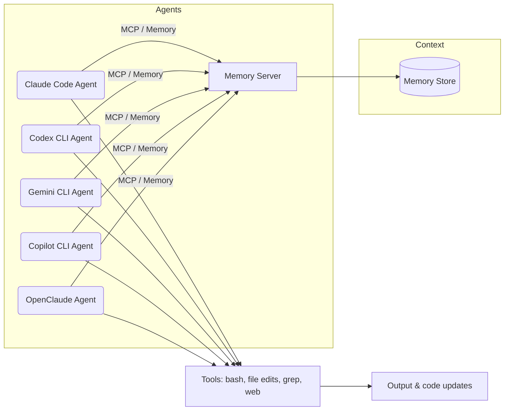

# AI Agents Starter Kit 🤖

> **Free AI Agents Starter Kit – Claude Code (Anthropic), Codex (OpenAI), Gemini (Google) & Copilot**  
> Speed up your development with AI agents – multi-model support, 5-minute setup, ready-to-use examples.

[](../LICENSE)
[](https://nodejs.org)
[](https://python.org)
[](https://lemon.dev/pro-agents)

---

## What is this Kit?

The **AI Agents Starter Kit** is a cross-platform repository (Node.js + Python) with everything a developer needs to start using **AI coding agents with multiple LLM models**:

- **Claude Code** (Anthropic)
- **Codex CLI** (OpenAI)
- **Gemini CLI** (Google)
- **GitHub Copilot CLI**
- **OpenClaude** (multi-model)

---

## Features

- ✅ **5-minute quickstart** for each platform
- ✅ **Agent & sub-agent** examples with parallel execution
- ✅ Pre-defined **skills**: debug, code generation, refactoring
- ✅ Customizable **hooks** before/after agent actions
- ✅ **Memory** via MCP (Model Context Protocol)
- ✅ **LLM-Wiki**: automatic search and context storage
- ✅ Automatic setup scripts (`bash scripts/setup.sh`)
- ✅ CI/CD with GitHub Actions
- ✅ Model comparison matrix
- ✅ Security checklist

---

## Quickstart

```bash
# 1. Clone the repository
git clone https://github.com/lemondev/ai-agents-starter-kit.git
cd ai-agents-starter-kit

# 2. Automatic setup (installs all CLIs)
bash scripts/setup.sh

# 3. Configure your API keys
cp .env.example .env
# Edit .env with your API keys

# 4. Run an example agent
cd examples/depurador-claude && claude
```

---

## CLI Installation

| CLI | Install |
|-----|---------|
| Claude Code | `curl -fsSL https://claude.ai/install.sh \| bash` |
| Codex CLI | `npm install -g @openai/codex` |
| Gemini CLI | `npm install -g @google/gemini-cli` |
| Copilot CLI | `npm install -g @github/copilot` |
| OpenClaude | `npm install -g @gitlawb/openclaude` |

---

## Model Comparison

| Feature | Claude Code | Codex CLI | Gemini CLI | Copilot CLI | OpenClaude |
|---------|------------|-----------|-----------|------------|-----------|
| **Install** | Script/Brew | npm | npm | npm | npm |
| **Source** | Closed (CLI avail.) | Open-source | Open-source | Closed | Open-source |
| **Base model** | Claude (Anthropic) | GPT-4o | Gemini | Copilot | Multi-backend |
| **Tools** | bash, file, grep | bash, web-search | file, web | bash, web | All unified |
| **Best for** | Agent flows, security | Fast CLI (Rust) | Enterprise/GCP | GitHub stack | Multi-provider |
| **Limits** | Anthropic subscription | ChatGPT Plus req. | Gemini quotas | Copilot active | Backend dependent |

---

## Architecture



---

## Security

- Store API keys in `.env` (never commit it)
- Use `.env.example` as a template
- Manually confirm critical agent actions
- See `AGENTS.md` for the full security checklist

---

## PRO Version

The free version includes starter templates and basic agents.

The **PRO** version offers:
- 🤖 Advanced agents (CI/CD, dependency monitoring, code security)
- 🔌 Premium plugins (Sentry, Datadog)
- 🚀 Early access to new models
- 💬 Priority support

> **[👉 Upgrade to PRO at lemon.dev/pro-agents](https://lemon.dev/pro-agents)**

---

## Project Structure

```
ai-agents-starter-kit/
├── AGENTS.md                    # Main documentation (pt-BR)
├── README.md                    # Portuguese README
├── .env.example                 # Environment variables template
├── package.json                 # Node.js config
├── pyproject.toml               # Python config
├── LICENSE                      # MIT
├── scripts/
│   ├── setup.sh                 # Cross-CLI setup (Bash)
│   ├── test_models.sh           # Smoke tests
│   ├── setup.py                 # Python setup
│   └── hook-before-edit.sh      # Lint hook
├── examples/
│   ├── depurador-claude/        # Debugger agent (Claude Code)
│   └── gerador-codex/           # Code generator (Codex)
├── docs/
│   └── README-en.md             # This file (English, SEO)
└── .github/
    └── workflows/
        └── tests.yml            # CI Pipeline
```

---

## License

MIT © [lemon.dev](https://lemon.dev)

---

*Keywords: AI coding agents, Claude Code, Codex CLI, Gemini CLI, Copilot CLI, free download, starter kit, LLM agents, multi-model, MCP, Model Context Protocol*
